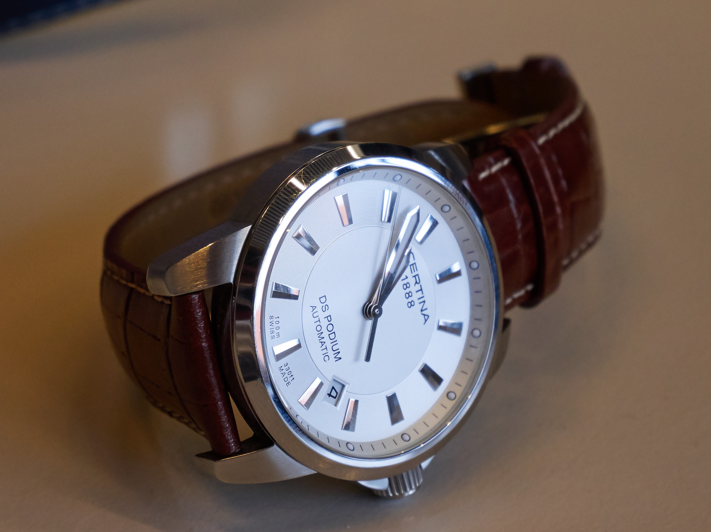
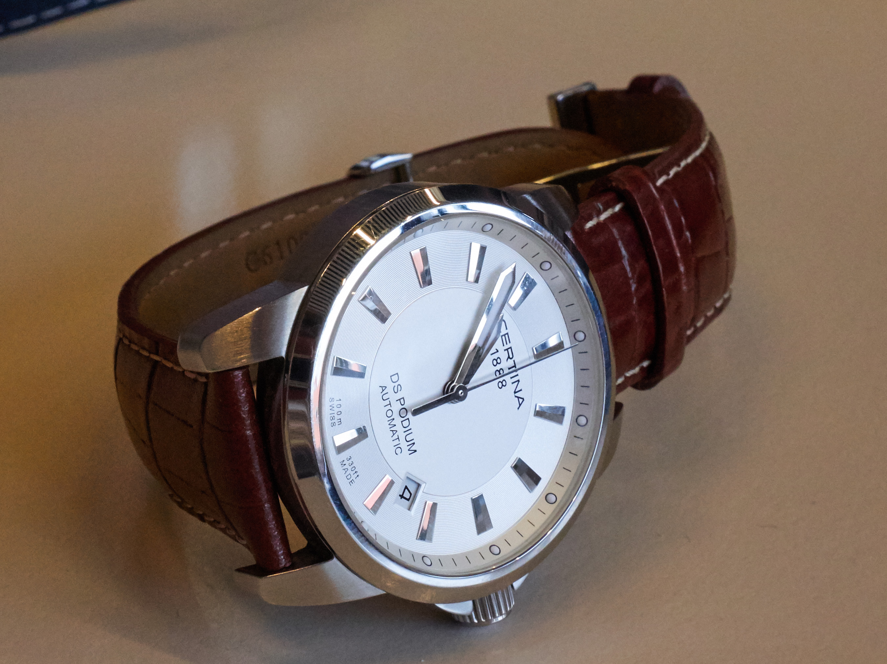
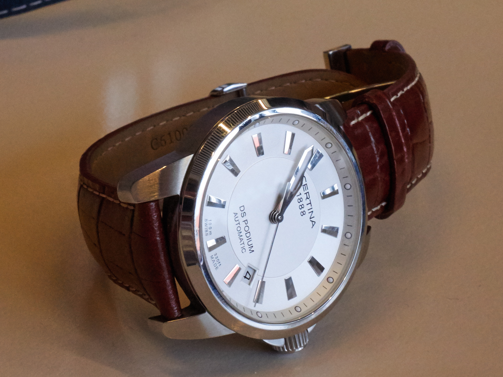

Práca s fototechnikou
=====================

Keď na fotoaparáte stlačíte spúšť, donútite vlastne svetlo, aby bolo vaším maliarom. Ako je to ale možné?

Ako to celé funguje
-------------------

Objektív premieta svetlo na snímaciu plochu, v súčasnosti digitálny snímač. Toto svetlo postupne vytvára finálnu fotografiu. Je to to isté, ako keď maliar postupne maľuje obraz.

Aby fotoaparát mohol vôbec zachytiť nejakú fotografiu, potrebuje objektív. Každý objektív má niekoľko parametrov, najpodstatnejšími sú ohnisková vzdialenosť a tzv svetelnosť. Ďalšie parametre ovplyvňujúce fotografiu sú crop faktor, uzávierka, clona a citlivosť.

### Typy objektívov

V súčastnosti sa väčšinou používajú tzv. *zoom objektívy*. Na rozdieľ od *pevných (fixných) objektívov(skiel)* sa jedná o objektívy s premenlivou ohniskovou vzdialenosťou. Zoom objektívy sú flexibilnejšie za cenu zložitejšiej konštrukcie a z toho vyplývajúcej vyššiej ceny, váhy a rozmerov pri zachovaní tých istých optických vlastností ako pevný objektív na danej ohniskovej vzdialenosti. Pokiaľ je prioritou vyššia kvalita, nižšia cena alebo lepšie parametre, je väčšinou jedinou možnosťou fix.

### Crop faktor

*Crop faktor* je pomer medzi dĺžkou uhlopriečky snímača s dĺžkou uhlopriečky 35mm kinofilmového políčka. Toto číslo sa dá používať napríklad pre porovnávanie ohniskových vzdialeností, hĺbiek ostrostí objektívov a pod. Crop faktory najbežnejších systémov:
* mobilné telefóny – crop faktor 27 ~ 6
* kompaktné fotoaparáty – crop faktor 5.6 ~ 6
* Micro 4/3 a 4/3 – crop faktor 2
* Canon APS-C – crop faktor 1.6
* Nikon, Fuji, Sony APS-C – crop faktor 1.5
* tzv. full frame fotoaparáty a 35mm kinofilm – crop faktor 1

### Ohnisková vzdialenosť

*Ohnisková vzdialenosť* objektívu určuje, aký „výrez“ z reality fotoaparát zachytí. Štandardne sa uvádza v mm. Čím väčšie číslo, tým menší výrez sa zobrazuje. To znamená, že čím väčšia je ohnisková vzdialenosť, tým väčší pocit priblíženia. Na táklade ohniskovej vzdialenosti sa objektívy delia na teleobjektívy (výrazne viac ako 50mm), štandardné (okolo 50mm) a širokoúhle objektívy (výrazne menej ako 50mm).

Výrez, ktorý fotoaparát zachytí, však závisí aj od veľkosti snímača. Aby bolo možné objektívy porovnávať z pohľadu výrezu je potrebné ohniskovú vzdialenosť objektívu vynásobiť crop faktorom.

Keď teda máme dva objektívy, jeden s ohniskovou vzdialenosťou 25mm určený pre systém Micro 4/3 a druhý s ohniskovou vzdialenosťou 32mm určený pre ľubovoľný APS-C systém, po vynásobení dostáváme pre oba objektívy ohniskovú vzdialenosť cca 50mm. Objektívy sú teda z hľadiska „výrezu“, ktorý poskytujú, porovnateľné.

Ďalšia vec súvisiaca s ohniskovou vzdialenosťou sa týka deformácie obrazu. Čím menšia je ohnisková vzdialenosť, tým väčšia je zvýraznenie objektov v blízkosti fotoaparátu. Napríklad v portrétnej fotografii použitie širokoúhleho objektívu má efekt zväčšenia napr. nosu. Preto sa v portrétnej fotografii používajú skôr mierne teleobjektívy (\>70mm).

Ohnisková vzdialenosť má vplyv aj na *hĺbku ostrosti* (popis viď kapitola o clone). Čím väčšia ohnisková vzdialenosť, tým menšia hĺbka ostrosti. Opačný efekt má vzdialenosť fotografovaného objektu, čím je ďalej, tým je väčšia hĺbka ostrosti.

### Uzávierka

V závislosti na dobe, ktorú je snímač vystavený svetlu, prijme viac alebo menej svetla. Zároveň ale pokiaľ sa v scéne vyskytuje pohyb, budú zachytené všetky jeho fáze, pohybujúce sa predmety budú teda rozmazané. Tento parameter na fotoaparátoch ovplyvňuje *doba uzávierky*, skrátene *uzávierka*, alebo aj *doba expozície*, *expozícia*. Doba uzávierky určuje čas, počas ktorého je snímač vystavený svetlu, udáva sa teda v sekundách. Časy sa väčšinou pohybujú v zlomkoch sekundy, napr. 1/200s.

Praktický dopad uzávierky závisí na tom, aký rýchly pohyb sa fotografuje. Pohybom rozumieme jak pohyb fotografovaného objektu (napr. auta), tak aj tras ruky.

Pre eliminovanie trasu platí jednoduché pravidlo – doba uzávierky musí byť kratšia ako prevrátená hodnota ohniskovej vzdialenosti objektívu prepočítanej na 35mm. Keď teda fotíme s fotoaparátom zo systému Micro 4/3 s objektívom s ohniskovou vzdialenosťou 25mm, minimálna doba uzávierky by mala byť 1/50s. Toto pravidlo nemusíme úplne brať do úvahy v prípade, že fotoaparát má systém na stabilizáciu obrazu.

Pre zachytenie rýchleho pohybu potrebujeme väčšinou časy uzávierky rádovo v stotinách až tisícinách sekundy. Pre fotografiu človeka väčšinou stačia časy rádovo v desatinách sekundy. Pokiaľ fotografujeme krajinu alebo nožnú scénu a použijeme statív alebo inú podložku, môže expozícia trvať aj minúty až hodiny.

### Clona

Množstvo svetla dopadajúceho na snímač zároveň ovplyvňuje aj *clona*. Clona je otvor pred snímačom, ktorý fyzicky obmedzuje množstvo svetla dopadajúceho na snímač tým, že v ceste svetla stavia prekážu. Na súčasných fotoaparátoch sa používa clona, u ktorej je možné meniť veľkosť otvoru. Týmto sa mení *clonové číslo*. Čím menšie toto číslo je, tým väčší je otvor clony (clona) a tým viac svetla dopadne na snímač za konštantný čas. Najmenšie možné clonové číslo (najväčšiu clonu), ktoré je na danom objektíve podporovaná, sa volá *svetelnosť*. Použitá clona okrem množstva dopadajúceho svetla ovplyvňuje aj tzv. *hĺbku ostrosti*. Jedná sa o oblasť, ktorá sa na výslednej fotografii javí zaostrená. Čím menšie clonové číslo a teda čím väčšia clona, tým je hĺbka ostrosti menšia.

V praxi teda práca s clonou znamená, že pokiaľ fotíme v noci, snažíme sa nastaviť čo najväčšiu clonu. To isté ale platí aj v prípade, že fotíme portrét a chceme, aby bola ostrá len portrétovaná osoba a pozadie bolo rozmazané. Naopak, pokiaľ fotíme krajinu, je treba zvýšiť clonové číslo (zmenšiť clonu) tak, aby bola čo najväčšia oblasť pokrytá hĺbkou ostrosti a teda ostrá.

#### Ukážky clony

Na následujúcich fotografiách je ukážka vplyvu clony na hĺbku ostrosti. Taktiež je vidieť dopad difrakcie pre clonu f16. Všetky fotografie sú zaostrené na text v spodnej časti ciferníku.

